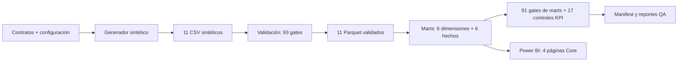
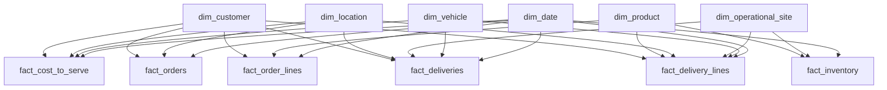
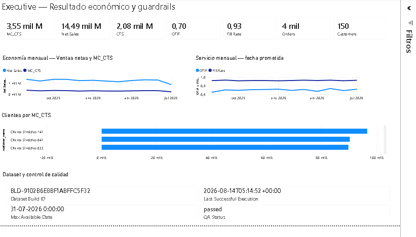
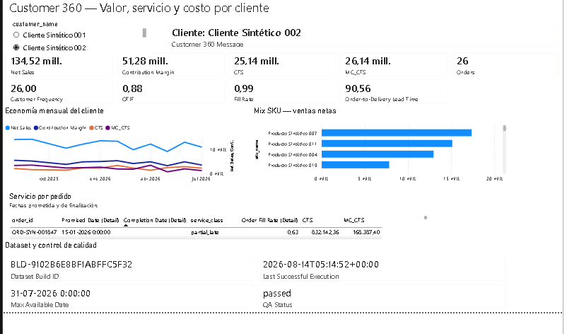
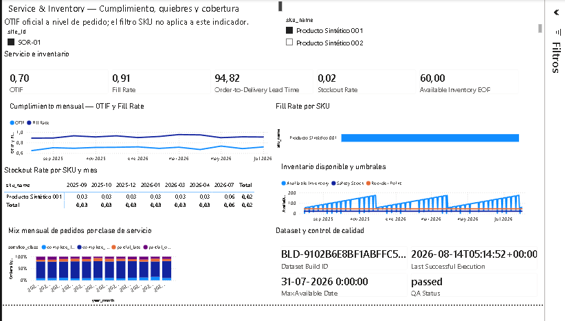
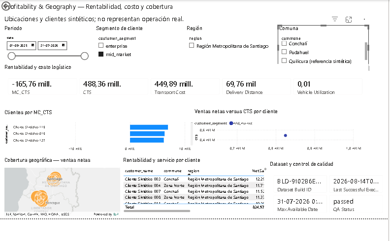

# System, b2b-prototipe

[](https://github.com/robertoafn/System-b2b-prototipe/actions/workflows/ci.yml)
[](LICENSE)


Sistema analítico B2B reproducible que conecta operación comercial, cumplimiento
logístico, inventario y cost-to-serve. Genera datos sintéticos deterministas,
aplica contratos y controles de calidad, publica marts en esquema estrella y los
expone en un dashboard Power BI de cuatro páginas.

> **Estado:** `V1.0`. El usuario aceptó el PBIX construido manualmente en Power BI
> Desktop como artefacto final; pipeline, controles, documentación y CI están
> cerrados para el tag `v1.0.0`.

## Problema que resuelve

En un contexto B2B, ventas, entregas, inventario y costos suelen vivir en grains
distintos. Unirlos directamente produce doble conteo y métricas ambiguas. Este
prototipo demuestra una ruta auditable para responder preguntas como:

- ¿cuánto valor económico queda después del costo variable y el cost-to-serve?
- ¿qué clientes combinan rentabilidad y nivel de servicio favorables?
- ¿dónde aparecen quiebres de stock y cómo evoluciona la cobertura?
- ¿cómo cambian OTIF, Fill Rate, distancia y utilización logística?

No usa datos reales ni representa el desempeño de una empresa. Todos los datos
operacionales son sintéticos; la geografía es sintética o referencial y está
etiquetada como tal.

## Arquitectura



El comando contractual ejecuta toda la cadena de forma transaccional: si una
etapa falla, no reemplaza la última corrida válida.

## Modelo estrella



Power BI contiene 34 relaciones dimensión `1:N`, filtro simple: 24 activas y 10
inactivas para roles de fecha. No existen relaciones fact-to-fact, many-to-many
ni bidireccionales. `meta_run` y `qa_results` son tablas técnicas desconectadas.

## Dashboard Power BI

### Executive



### Customer 360



### Service & Inventory



### Profitability & Geography



El artefacto actual está en [`powerbi/b2b_v1.pbix`](powerbi/b2b_v1.pbix). La guía
de construcción y aceptación manual está en
[`docs/chats_instruction/POWER-BI-INTERACTIVE-GUIDE.md`](docs/chats_instruction/POWER-BI-INTERACTIVE-GUIDE.md).

## KPI

| Área | KPI oficiales |
|---|---|
| Economía | Net Sales, Variable Product Cost, Contribution Margin, CTS, MC_CTS, Average Order Value |
| Comercial | Orders, Customer Frequency, Customers |
| Servicio | OTIF, Fill Rate, Order-to-Delivery Lead Time |
| Inventario | Stockout Rate, Available Inventory EOP |
| Logística | Delivery Distance, Transport Cost, Vehicle Utilization |

El modelo agrega 2 medidas de soporte (`Eligible Orders`, `OTIF Orders`) y 20
medidas auxiliares para visuales, trazabilidad y QA: 39 medidas DAX en total.

Reglas clave:

- ventas y costo variable se reconocen sobre cantidad entregada;
- `MC_CTS = Net Sales - Variable Product Cost - CTS`;
- CTS y MC_CTS no se atribuyen a SKU en V1.0;
- OTIF se calcula a grain pedido elegible;
- Fill Rate es ratio de sumas;
- inventario EOP usa la última fecha visible y no suma snapshots.

Las definiciones completas están en
[`docs/KPI-POWERBI-SPEC.md`](docs/KPI-POWERBI-SPEC.md).

## Ejecución local

Requiere Python 3.12 o compatible.

```powershell
python -m pip install -r requirements.txt
python -m src.pipeline --config config/scenario_base.yaml
python -m pytest -q
```

El segundo comando ejecuta:

```text
generación → validación → marts → controles → manifest
```

Contrato de salida:

- código `0`: todas las etapas y gates obligatorios pasaron;
- código distinto de `0`: existe un error o gate fallido;
- una falla conserva la última publicación válida;
- no requiere red, credenciales ni datos reales.

## Evidencia de QA

Escenario canónico `B2B-V1-BASE`:

| Control | Resultado |
|---|---:|
| `dataset_build_id` | `BLD-9102B6E8BF1ABFFC5F32` |
| Datasets sintéticos | 11 |
| Gates de fuente | 93/93 passed |
| Tablas de marts | 14 |
| Gates de marts | 91/91 passed |
| Controles KPI Python | 17 |
| Pruebas automatizadas | 46 passed |
| Pedidos / líneas | 4.000 / 10.000 |
| Entregas / líneas de entrega | 5.000 / 12.483 |

CI ejecuta pruebas, reconstruye el escenario en una carpeta temporal y compara
los hashes deterministas y controles KPI con el baseline versionado. `meta_run`
se excluye del checksum combinado determinista porque contiene la hora y el ID de
cada ejecución.

## Contratos y estructura

```text
config/                      escenario canónico
data/synthetic/              CSV sintéticos
data/validated/              Parquet validados
data/marts/                  esquema estrella y tablas técnicas
data/manifest/               manifest, QA y controles KPI
schemas/                     contratos de esquema
src/                         generación, validación, marts y pipeline
tests/                       unitarias, contrato, negativas, golden e integración
powerbi/                     PBIX y fuente versionable auxiliar
docs/                        contratos públicos sanitizados
```

Orden de autoridad para agentes y LLM:

1. [`docs/PROJECT-CONTROL.md`](docs/PROJECT-CONTROL.md)
2. [`docs/MVP-SPEC.md`](docs/MVP-SPEC.md)
3. [`docs/DATA-CONTRACT.md`](docs/DATA-CONTRACT.md)
4. [`docs/KPI-POWERBI-SPEC.md`](docs/KPI-POWERBI-SPEC.md)
5. [`AGENTS.md`](AGENTS.md)

## Limitaciones conocidas

- Los datos son sintéticos y no sirven como benchmark empresarial.
- No incluye ERP, CRM, facturación, pagos, forecasting, routing ni optimización.
- El mapa ArcGIS puede requerir conectividad y disponibilidad del visual.
- El artefacto Power BI aceptado de V1.0 es PBIX. El repositorio incluye un script
  TMDL de medidas y un contrato legible; una exportación PBIP/PBIR completa queda
  como mejora de versionado posterior.

## Próximos pasos posibles

1. opcionalmente guardar `b2b_v1.pbix` como PBIP con TMDL y PBIR desde Power BI
   Desktop;
2. revisar y versionar el diff generado, excluyendo caches locales `.pbi`;
3. abrir contratos nuevos antes de incorporar cualquier alcance post-V1.0.

## Licencia

[MIT](LICENSE). Los datos sintéticos y el software pueden reutilizarse bajo sus
términos; Power BI y ArcGIS conservan sus licencias y marcas respectivas.
